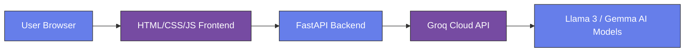

# 🚀 ChatGO - AI Chatbot

<p align="center">
  
  
  
  
  
</p>

<p align="center">
  <strong>Aplikasi chat AI dengan streaming real-time, light/dark mode, dan syntax highlighting</strong><br>
  Dibangun dengan Python FastAPI + Groq API + HTML/CSS/JS murni
</p>

<p align="center">
  <a href="#demo">Demo</a> •
  <a href="#fitur">Fitur</a> •
  <a href="#tech-stack">Tech Stack</a> •
  <a href="#cara-menjalankan">Cara Menjalankan</a> •
  <a href="#deployment">Deployment</a>
</p>

---

## 📸 Demo

<table>
  <tr>
    <td align="center"><strong>Light Mode</strong></td>
    <td align="center"><strong>Dark Mode</strong></td>
    <td align="center"><strong>Mobile View</strong></td>
  </tr>
  <tr>
    <td></td>
    <td></td>
  </tr>
</table>


**[🔗 Live Demo - ChatGO di Railway](https://chatgo.up.railway.app)**

---

## ✨ Fitur Unggulan

| Fitur | Status | Deskripsi |
|:------|:------:|:----------|
| 💬 **Real-time Chat** | ✅ | Kirim pesan dan dapatkan respons instan dari AI |
| 🎯 **Streaming Response** | ✅ | Teks muncul huruf per huruf |
| 🌙 **Light/Dark Mode** | ✅ | Toggle antara mode terang dan gelap |
| 📋 **Copy Message** | ✅ | Salin pesan AI dengan satu klik |
| 💾 **Chat History** | ✅ | Percakapan tersimpan di localStorage browser |
| 🔄 **Multiple AI Models** | ✅ | Pilih dari 4 model AI (Llama 3.3 70B, Llama 3.1 70B, Llama 3.1 8B, Gemma 2 9B) |
| 📱 **Responsive Design** | ✅ | Bekerja sempurna di hp, tablet, dan desktop |
| 🎨 **Code Highlighting** | ✅ | Syntax highlighting untuk kode |
| 🧹 **Clear Chat** | ✅ | Hapus semua percakapan dengan dialog konfirmasi |
| ⚡ **Auto-detect API URL** | ✅ | Bisa jalan di localhost dan production tanpa config ulang |

---

## 🧠 Model AI Tersedia

| Model | Kode | Kecepatan | Kualitas | Rekomendasi |
|-------|------|-----------|----------|-------------|
| **Llama 3.3 70B** | `llama-3.3-70b-versatile` | Medium | ★★★★★ | **Default (Terbaik)** |
| **Llama 3.1 70B** | `llama-3.1-70b-versatile` | Medium | ★★★★☆ | Alternatif handal |
| **Llama 3.1 8B** | `llama-3.1-8b-instant` | Sangat Cepat | ★★★☆☆ | Untuk respons cepat |
| **Gemma 2 9B** | `gemma2-9b-it` | Cepat | ★★★☆☆ | Model dari Google |

> Semua model tersedia via Groq API

---

## 🛠️ Tech Stack



| Lapisan | Teknologi | Keterangan |
|---------|-----------|-------------|
| **Frontend** | HTML5 + CSS3 + Vanilla JS | Murni tanpa framework |
| **Backend** | Python + FastAPI + Uvicorn | REST API dengan streaming SSE |
| **AI Provider** | Groq Cloud API | 30 request/menit |
| **Storage** | LocalStorage (client-side) | History chat di browser |
| **Deployment** | Railway / Render | Hosting |

---

## 📁 Struktur Proyek

```
chatgo/
├── main.py              # Backend FastAPI (endpoint chat, streaming)
├── requirements.txt     # Python dependencies
├── .env                 # API key (jangan commit!)
├── .gitignore           # File yang diabaikan Git
├── static/
│   └── index.html      # Frontend lengkap (HTML + CSS + JS)
└── README.md           # Dokumentasi ini
```

---

## 🚀 Cara Menjalankan {#cara-menjalankan}

### Prasyarat

| Requirement | Keterangan |
|-------------|------------|
| Python 3.8+ | [Download Python](https://python.org) |
| Akun Groq | [Daftar](https://console.groq.com) - tanpa kartu kredit |
| Git (opsional) | [Download Git](https://git-scm.com) |

### Langkah 1: Clone Repository

```bash
git clone https://github.com/digiportfolio/chatgo.git
cd chatgo
```

### Langkah 2: Buat Virtual Environment

```bash
# Windows
python -m venv venv
venv\Scripts\activate

# Mac / Linux
python3 -m venv venv
source venv/bin/activate
```

### Langkah 3: Install Dependencies

```bash
pip install -r requirements.txt
```

### Langkah 4: Setup API Key

Buat file `.env` di root folder:

```env
GROQ_API_KEY=gsk_your_api_key_here
```

Dapatkan API key dari: [https://console.groq.com/keys](https://console.groq.com/keys)

### Langkah 5: Jalankan Aplikasi

```bash
python main.py
```

### Langkah 6: Buka Browser

Akses: **http://localhost:8000**

---

## 📦 Dependencies (`requirements.txt`)

```txt
fastapi==0.115.0
uvicorn==0.30.0
groq==0.9.0
python-dotenv==1.0.0
httpx==0.27.0
```

---

## 🔧 Konfigurasi Penting

### Mengaktifkan/Nonaktifkan Streaming

Di `static/index.html`, cari baris:

```javascript
const USE_STREAMING = true;  // Set ke false untuk non-streaming
```

### Mengganti Model Default

Di `static/index.html`, cari:

```javascript
const DEFAULT_MODEL = 'llama-3.3-70b-versatile';  // Ganti sesuai kebutuhan
```

### Mengganti Port (jika 8000 sudah dipakai)

Di `main.py`, baris terakhir:

```python
uvicorn.run(app, host="0.0.0.0", port=8001)  # Ganti 8001
```

---

## 🎯 Fitur Detail

### 1. Copy Pesan
- Tombol **"📋 Salin"** berada **di luar bubble pesan AI** (di bawah kanan)
- Klik untuk menyalin teks ke clipboard
- Notifikasi "✅ Pesan disalin!" muncul

### 2. Dark Mode
- Klik tombol 🌙 di header
- Preferensi tersimpan di localStorage
- Mode bertahan setelah refresh

### 3. Chat History
- Semua percakapan tersimpan otomatis
- Data tetap ada setelah refresh browser
- Tombol 🗑️ dengan konfirmasi modal untuk hapus semua

### 4. Multiple AI Models
- Dropdown "Pilih Model AI" di header
- **Default model: Llama 3.3 70B** (paling pintar)

### 5. Code Highlighting
- Support Python, HTML, CSS, JavaScript, dan lainnya
- Syntax highlighting warna-warni di dalam ``` blocks
- Kode tetap terbaca rapi di dark mode

### 6. Auto-detect API URL
- Otomatis pakai `localhost:8000` saat develop
- Otomatis pakai domain production saat deploy
- **Tidak perlu ganti-ganti file!**

---

## 🌐 Deployment ke Production {#deployment}

### Option 1: Railway.app (Rekomendasi - Tanpa Kartu Kredit)

1. Push kode ke GitHub
2. Buka [https://railway.app](https://railway.app)
3. Login dengan GitHub
4. **New Project** → **Deploy from GitHub repo**
5. Pilih repository `chatgo`
6. **Variables** → Tambah `GROQ_API_KEY`
7. Deploy otomatis! 🎉

### Option 2: Render.com (Butuh Kartu Kredit verifikasi)

1. Push kode ke GitHub
2. Buka [https://render.com](https://render.com)
3. **New Web Service** → Connect GitHub
4. Settings:
   - Build: `pip install -r requirements.txt`
   - Start: `uvicorn main:app --host 0.0.0.0 --port $PORT`
5. Add Environment Variable: `GROQ_API_KEY`
6. Deploy

---

## 🧪 Testing API

### Test Endpoint Chat (tanpa streaming)

```bash
curl -X POST http://localhost:8000/chat \
  -H "Content-Type: application/json" \
  -d '{"message":"Halo, apa kabar?", "model":"llama-3.3-70b-versatile"}'
```

### Test Health Check

```bash
curl http://localhost:8000/health
```

### Expected Response

```json
{
  "status": "ok",
  "available_models": [
    "llama-3.3-70b-versatile",
    "llama-3.1-70b-versatile",
    "llama-3.1-8b-instant",
    "gemma2-9b-it"
  ]
}
```

---

## 🐛 Troubleshooting

| Masalah | Solusi |
|---------|--------|
| **Error 400 - Model decommissioned** | Ganti model di dropdown (Llama 3.3 70B atau Llama 3.1 70B) |
| **API Key invalid** | Cek file `.env` dan restart server |
| **Port 8000 sudah dipakai** | Ganti port di `main.py` menjadi `port=8001` |
| **Streaming tidak jalan** | Set `USE_STREAMING = false` di HTML (sementara) |
| **CORS error** | Pastikan CORS middleware aktif di `main.py` |
| **Failed to fetch di production** | Tunggu redeploy selesai (1-2 menit) lalu refresh hard (Ctrl+F5) |
| **Railway crashed** | Cek log: biasanya `GROQ_API_KEY` tidak diset |

---

## 📈 Roadmap

- [ ] Voice input (Web Speech API)
- [ ] Export chat ke PDF / Markdown
- [ ] Multi-user authentication (Login)
- [ ] Database PostgreSQL untuk history permanen
- [ ] Custom system prompt
- [ ] Temperature slider (kreativitas AI)
- [ ] Pinned messages / bookmark

---

## 🤝 Kontribusi

Pull requests sangat diterima! Untuk perubahan besar:

1. **Fork** repository ini
2. Buat **branch fitur** (`git checkout -b fitur-keren`)
3. **Commit** perubahan (`git commit -m 'Tambahkan fitur keren'`)
4. **Push** ke branch (`git push origin fitur-keren`)
5. Buka **Pull Request**

---

## 📝 License

**MIT License** - Bebas digunakan untuk belajar, portofolio, dan komersial.

```
Copyright (c) 2025 Fadli

Permission is hereby granted, free of charge, to any person obtaining a copy
of this software and associated documentation files (the "Software"), to deal
in the Software without restriction...
```

---

## 👨‍💻 Author

**Fadli** (SAYA-FADLI)

- GitHub: [@digiportfolio](https://github.com/digiportfolio)
- LinkedIn: [linkedin.com/in/fadli](https://linkedin.com/in/fadli) *(opsional)*
- Portfolio: [fadli.dev](https://fadli.dev) *(opsional)*

---

## 🙏 Acknowledgments

| Pihak | Kontribusi |
|-------|------------|
| **[Groq](https://groq.com)** | API yang cepat (Mixtral, Llama 3, Gemma) |
| **[FastAPI](https://fastapi.tiangolo.com)** | Framework backend modern Python |
| **[Meta AI](https://ai.meta.com/llama/)** | Llama 3.3 & Llama 3.1 models |
| **[Google](https://ai.google.dev/gemma)** | Gemma 2 model |
| **[Railway](https://railway.app)** | Hosting |

---

## ⭐ Show Your Support

**Beri ⭐ di GitHub jika proyek ini bermanfaat!**

<p align="center">
  <a href="https://github.com/digiportfolio/chatgo">
    
  </a>
</p>

---

<p align="center">
  <b>Dibuat dengan ❤️ untuk portofolio Python Developer</b><br>
  <sub>© 2025 Fadli - MIT License</sub>
</p>

